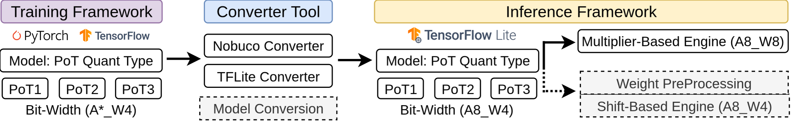
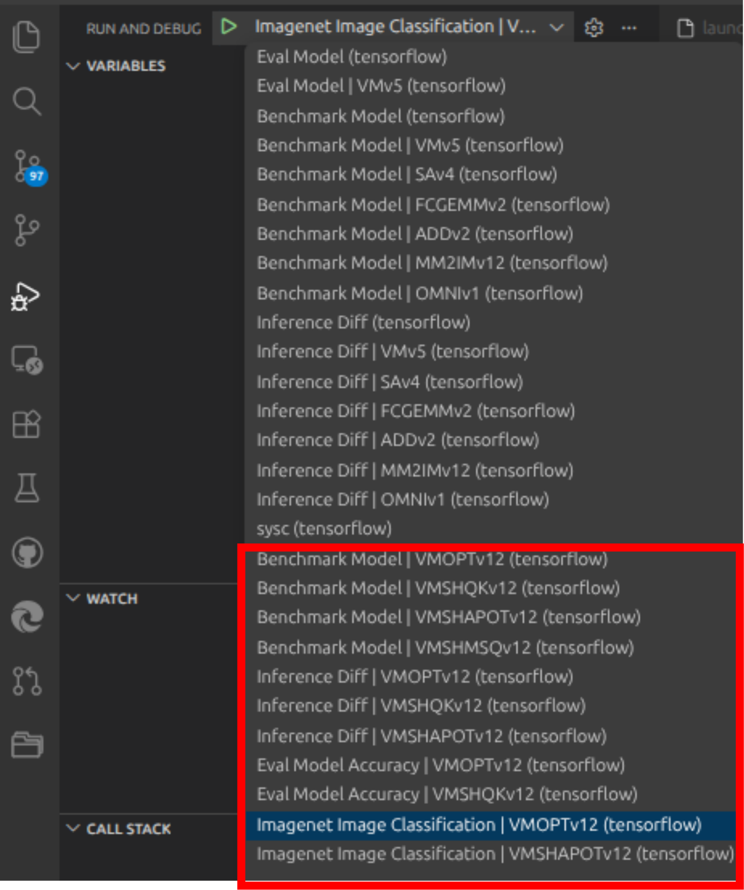

# PoTAcc: A Pipeline for End-to-End Acceleration of Power-of-Two Quantized DNNs

This repository will contain the code for the PoTAcc pipeline.


## Steps:
### 1. Download SECDA-TFLite v2.

```bash
git clone https://github.com/gicLAB/SECDA-TFLite.git && \
cd SECDA-TFLite && \
git submodule init && \
git submodule update && \
sudo apt install -y jq ssh rsync
```

### 2. Dowload PoTAcc repo in the SECDA-TFLite v2 path

```bash
git clone https://github.com/gicLAB/PoTAcc.git && \
sudo chmod +x ./PoTAcc/model_inference/*.sh
```

### 3. Setup the SECDA-TFLite v2.

Now go to the [https://github.com/gicLAB/SECDA-TFLite.git](https://github.com/gicLAB/SECDA-TFLite.git) to complete the set up of SECDA-TFLite.

- Start from "Configuring SECDA-TFLite".

- Use Dev Container Method (2.A) of VSCode to set up the development environment.

- Verify that you can run SECDA-TFLite v2 for vm/v5 accelerator, **simulation, hardware automation and secda_apps_evaluation_suite** for Pynq-Z1/Pynq-Z2/KRIA  board before integrating PoTAcc.

- If you face any issues setting up SECDA-TFLite v2, please create an issue in the SECDA-TFLite repository.

### 4. PoTAcc Integration Steps

```bash
cd PoTAcc/model_inference/ && \
./potacc_integration.sh && \
cd ../..
```
### 5. Harware Generation

- In this 'PoTAcc/model_inference/hardware_automation/generated' folder we have included the related bit-stream files for PoTAcc.

- To genrate a FPGA bit-stream ***outside of Dev-Container*** please follow SECDA-TFLite [hardware_automation](https://github.com/gicLAB/SECDA-TFLite/tree/main/hardware_automation).

### 6. Run Application on Simulation

- Within the VSCODE 'run and debug (Ctrl+Shift+D)', one should see launch tasks at the end like following figure.

<div align="center">
  
</div>

- Four Tasks/Application
  - Benchmark Model : run a Model on an Accelerator to understand execution time layer by layer.
  - Inference Diff : Verify the correctness of the accelerator on against CPU execution for a Model.
  - Eval Model Accuracy : Test Model Accuracy on CIFAR-10 Dataset when running on CPU/FPGA.
  - Imagenet Image Classification : Test Model Accuracy on ImageNet Dataset when running on CPU/FPGA.

- Select any of the task (i.e. Application) from the dropDown Menu to simulate.

### 7. Run Application on FPGA

- Use 'secda_apps_evaluation_suite' in SECDA-TFLite.

---

## PoTAcc Folder structure:

```text
|-- tensorflow/
  |-- .vscode/
    |-- launch.json
    |-- tasks.json
|-- data/
  |--cifar10/
    |--labels/
    |--models/
    |--testData/
  |--imagenet/
    |--labels/
    |--models/
    |--testData_10k_0/
    |--testData_10k_1/
    |--testData_10k_2/
    |--testData_10k_3/
    |--testData_10k_4/
|-- hardware_automation/
  |-- configs/
    |-- POTACC/
      |-- VMOPTv12_4_KRIA_250M.json
      |-- VMSHQKERASv12_4_KRIA_250M.json
      |-- VMSHAPOTv12_4_KRIA_250M.json
      |-- VMSHMSQv12_4_KRIA_250M.json
|-- src/
  |-- secda_delegates/
    |-- vm_opt_delegate/
      |-- v12/
    |-- vm_shift_delegate/
      |-- v12/
|-- potacc_integration.sh
|-- readme.md

```
---
## Cite:

### Journal:

```text
@article{SAHA2026TCASAI,
      title={{PoTAcc: A Pipeline for End-to-End Acceleration of Power-of-Two Quantized DNNs}}, 
      author={Rappy Saha and Jude Haris and Nicolas Bohm Agostini and David Kaeli and José Cano},
      journal={IEEE Transactions on Circuits and Systems for Artificial Intelligence},
      year={2026}
      comment = {Accepted for publication}
}
```

### Conference:

```text
@article{saha2024accelerating,
  author  = {Rappy Saha and Jude Haris and José Cano},
  title   = {{Accelerating {PoT} Quantization on Edge Devices}},
  journal = {arXiv preprint arXiv:2409.20403},
  year    = {2024}
}
```


